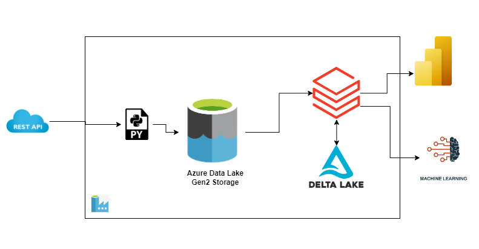

# Property Scraping from Zillow API

This is an end-to-end data engineering project involving fetching data from a property listing website called Zillow, storing this data in a data lake and using databricks to transform the raw data into a format better suited for reporting and advanced analytics.

# Architecture

# Data Source
The source data is fetched from Zillow API through a rapidapi.com service. Rapid API provides documentation on using any API you select. A subscription is required to make calls.

# Steps

## Fetch from API
Using the requests library in Python I'm able to make `GET` requests to the Zillow API by querying my desired locations. Results are stored in json format into Azure Data Lake Storage. API response is paginated with 40 results per page so I run through all pages to pull in all available content for the `GET` query.

## Mounting ADLS to Databricks
When you mount storage to databricks, you create a connection between the storage account and databricks
1. Set up secrets in Key Vault. Create a service principal via Azure App Registration for databricks to use in connecting to ADLS. Add this service principal to the keyvault as well.
2. Grant storage blob contributor role to the service principal.
3. Set up scope in Databricks (yourdatabricksURL#secrets/createScope) to allow use of the key vault.
4. Run mounting script

# Challenges and Future Enhancements

1. Use Azure key vault to manage credentials--done
2. Design a strategy to handle duplicates when data is pulled in subsequent days
3. Enable automated deployment
4. Deploy to Azure Data Factory with permissions granted to ADF
5. Mount storage to databricks